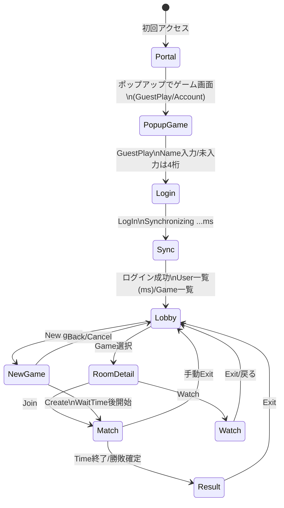
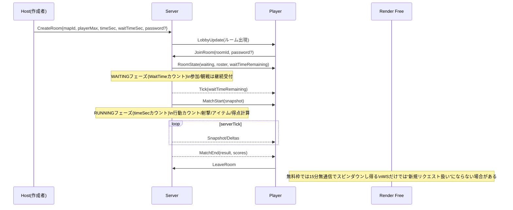
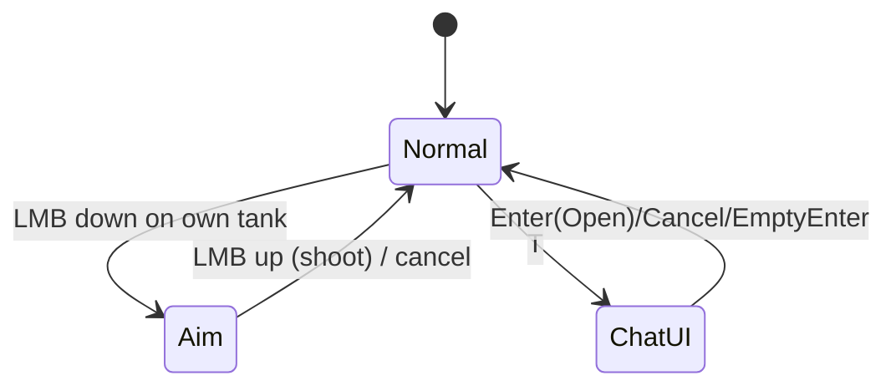
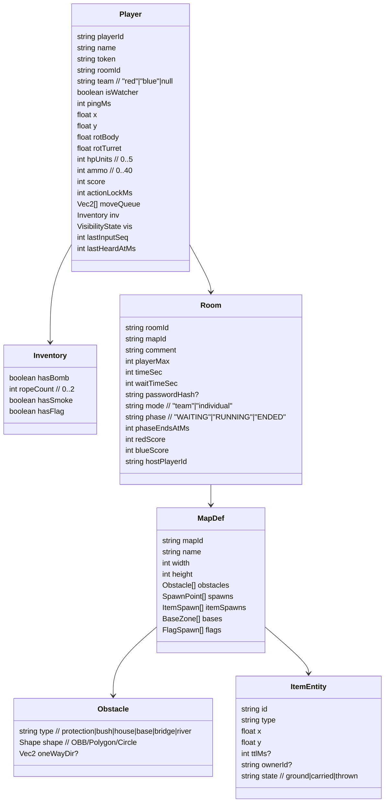

# TankMania系クローン実装仕様書

## エグゼクティブサマリ

本仕様書は、TankMania系の系譜にあるオンライン対戦Flashゲームの挙動を、TankMatch（Tank Match wikiに記録された操作・ルール・UI）を参照して再現し、Render無料枠で稼働させる前提まで落とし込んだ実装設計である。TankMatchは、TankMania→TM Clone→Tank Master→Tank Matchへ連なる系譜・公開史がTank Match wikiに整理されている（例：TankManiaサービス終了日時、後継の開始・終了、公開時期）。citeturn11view0

最大の技術リスクは、Render無料枠における「15分無通信でスピンダウン」「復帰に最大1分」「ローカルFSが揮発」「無料枠WebSocketが切断されやすい（少なくとも“既存WebSocketは新規リクエスト扱いにならずアイドル判定に効かない”という公式サポート回答がある）」という運用制約である。citeturn0search4turn0search2turn0search7  
よって、設計上は「サーバ権威の状態同期」「切断前提の自動再接続」「再接続時の復帰手順（rejoin token + スナップショット）」「スピンダウン回避（HTTP keepaliveを別途発生させる/外部監視で定期アクセス）」を最初から含める。citeturn8view0turn0search2turn0search4

ゲーム仕様の核（互換性の核）は、クリック移動・移動予約・Zキャンセル・AIMドラッグ射撃・視点の非追従・行動カウント（5→0、行動不能）・チャット入力中の全操作ロックである。citeturn6view0turn17view0  
アイテム（ライフ/アモ/ボム/ロープ/スモーク/地雷/フラッグ）と障害物（ワンウェイ/ブッシュ/ハウス/ベース/ブリッジ/リバー）はTank Match wikiに定義があり、この定義に整合するサーバ処理（取得条件・所持上限・例外（スモークは行動カウント無し）・判定）を採用する。citeturn5view0turn4view1turn3view2

---

## 目的とMVP範囲

目的は、TankMania系の「情報戦×ディレイ（行動カウント）」の手触りを維持したまま、ブラウザでのオンライン対戦（観戦含む）を実装し、固定マップのみで遊べる状態を作ることである（マップDB/エディタは後回し）。TankMatchのロビー/入室/試合手順や主要UIはTank Match wikiにスクリーンショット付きで示されているため、MVPはそれを最優先で再現する。citeturn3view0turn3view1turn18view2turn20view1

MVP範囲を「Must（MVP必須）」「Should（MVP後半）」「Later（将来）」に分ける。

| 区分 | 機能 | 内容 |
|---|---|---|
| Must | ゲストログイン | GuestPlay→Name入力→LogIn。未入力時はランダム4桁名。ログイン中は“Synchronizing …ms”。citeturn2view0turn18view0turn18view1turn18view3 |
| Must | ロビー | ユーザ一覧（ms表示）、ゲーム一覧、New game/Help/Setting/Exit、Direct chat。citeturn18view2turn20view1 |
| Must | ルーム作成 | Newgame→GameID/PlayerMax/Time/WaitTime/Password入力→Create。Optionは表示のみ（未実装可）。citeturn3view1turn20view0 |
| Must | 参加/観戦 | ゲーム一覧選択→Join/Watch。鍵アイコン点灯時はパスワード必須。citeturn3view0turn19view0 |
| Must | 対戦コア | クリック移動、最大移動距離制限、移動予約、Zで予約キャンセル、AIM射撃、視点非追従、ミニマップクリック移動、ズーム/回転、Space全体表示。citeturn6view0turn17view0turn17view1 |
| Must | 行動カウント | 行動後に5→0カウント、カウント中は行動不可。例外：スモーク展開は行動カウント無し。citeturn6view0turn5view0 |
| Must | 個人戦/チーム戦 | 個人戦：耐久/残弾/残り時間/得点。チーム戦：FF無効、フラッグ取得/帰還で得点。citeturn3view2 |
| Should | アイテム/障害物 | wiki記載の全アイテム/障害物を実装、特にロープ・スモーク・フラッグを優先。citeturn5view0turn4view1turn3view2 |
| Should | 再接続/復帰 | WS切断→自動再接続→rejoin→スナップショットで復帰。Render上の切断/再起動前提。citeturn8view0turn0search2turn0search4 |
| Later | マップDB/エディタ | MapID入力で巨大マップ群からロード（将来）。MVPは固定同梱。citeturn3view1turn11view0 |
| Later | 実況/外部連携 | “実況（ねとらじ等）”の文化はあるがMVP対象外。citeturn11view0turn10search12 |

---

## 画面遷移図とタイムライン

画面遷移はTank Match wikiの手順（ポップアップ起動、ゲスト導線、ロビー、参加/作成）に合わせる。citeturn2view0turn3view0turn3view1



ゲーム進行タイムラインは「WaitTime（待機）→試合開始→制限時間→終了」で構成する。WaitTime/TimeはNew Game設定に存在する。citeturn3view1turn20view0


citeturn0search4turn0search2

---

## UI/HUD仕様

本章は「TankMatchのUI要素（スクリーンショットで確認できる事実）」と「クローン実装に必要な座標/サイズ/フォントの確定値（推奨値）」を分離する。UI要素の存在根拠は、Tank Match wiki添付のロビー/ログイン/ヘルプ/ゲーム画面で確認できる。citeturn18view2turn16view0turn17view0turn20view1

image_group{"layout":"carousel","aspect_ratio":"16:9","query":["Tank Match wiki main lobby screenshot","Tank Match gameplay screenshot team play status bar","Tank Match wiki new game window screenshot","Tank Match wiki help controls screenshot"],"num_per_query":1}

### 参照解像度と座標系

**参照解像度（推奨）**：`1280×720` をUIデザイン基準（Design Resolution）とし、実際のCanvasサイズへ「等比スケール＋レターボックス」で適用する。  
**座標系**：左上原点 `(0,0)`、右方向が`+x`、下方向が`+y`。UIは原則スクリーン空間（camera非依存）、ゲームオブジェクトはワールド空間（camera依存）。  
**スケール**：`uiScale = min(viewportW/1280, viewportH/720)`、UI座標は `round(designPx * uiScale)`。

### ログイン画面

TankMatchにはGuestPlay→Name入力→LogInという導線がある（画像でGuestPlay/Accountボタン、Name入力、LogIn、Synchronizing表示が確認できる）。citeturn18view0turn18view1turn18view3turn2view0

**レイアウト（推奨：1280×720基準）**

| 要素 | 座標(x,y) | サイズ(w,h) | フォント/色（例） | 挙動 |
|---|---:|---:|---|---|
| タイトルロゴ | (80, 60) | (1120, 140) | 48px, bold | クリック無効 |
| GuestPlayボタン | (460, 520) | (160, 56) | 22px | クリックでName入力ダイアログへ |
| Accountボタン | (660, 520) | (160, 56) | 22px | MVPでは非活性でも可 |
| Name入力パネル | center | (520, 360) | 20px | LogInで接続開始 |
| Synchronizing表示 | (centerX-200, centerY-20) | 自動 | 20px | “…ms”表示（RTT推定）citeturn2view0 |

### メインロビー

ロビーには「Game一覧」「User一覧（ms表示）」「Chat欄」「New game/Help/Setting/Exit」「Direct chat」等が存在する。citeturn18view2turn20view1

**レイアウト（推奨：1280×720基準）**

| 領域 | 座標(x,y) | サイズ(w,h) | 内容 |
|---|---:|---:|---|
| ヘッダ | (0,0) | (1280, 56) | 左：Game数、右：Main lobby |
| Game一覧 | (40, 70) | (1200, 140) | 進行中ゲーム行（クリックで詳細へ） |
| User一覧 | (40, 230) | (520, 380) | `Name (pingMs)`、pingはサーバとのタイムラグ表示。citeturn2view0turn18view2 |
| Chatログ/入力 | (600, 230) | (640, 380) | ロビー会話 |
| フッタメニュー | (0, 660) | (1280, 60) | Direct chat / New game / Help / Setting / Exit |

### ゲーム一覧行と参加ダイアログ

ゲーム一覧は「残り時間」「人数（観戦数）」「コメント」「マップ名」「立てた人」などの列を持つ（ヘッダ画像で確認）。citeturn19view2  
ゲーム詳細ダイアログにはJoin/Watch/Back、チーム選択、パスワード入力欄がある（画像で確認）。citeturn19view0turn3view0  
鍵アイコン点灯のゲームはパスワードが必要。citeturn3view0

**レイアウト（推奨：1280×720基準）**

| 要素 | 座標(x,y) | サイズ(w,h) | 挙動 |
|---|---:|---:|---|
| ゲーム詳細パネル | center | (520, 520) | Join/Watch/Back |
| チーム選択 | (centerX-220, centerY+80) | (440, 56) | TeamPlay時にRed/Blueのラジオ |
| パスワード入力 | (centerX+40, centerY+80) | (240, 40) | 鍵ありルームで必須 |
| Joinボタン | (centerX-200, centerY+220) | (120, 56) | 参加 |
| Watchボタン | (centerX-60, centerY+220) | (120, 56) | 観戦 |

### New Game作成パネル

Newgameクリックで新規ゲーム設定ウィンドウが開き、GameID/PlayerMax/Time/WaitTime/Password/Optionを設定してCreateする。citeturn3view1turn20view0  
Timeは“デフォルトである10分前後”が目安とされる。citeturn3view1

**レイアウト（推奨：1280×720基準）**

| 入力項目 | 座標(x,y) | サイズ(w,h) | 型 | 制約 |
|---|---:|---:|---|---|
| GameID | (centerX-240, centerY-160) | (360, 40) | string | 固定マップIDのみ許可（MVP）citeturn3view1 |
| Comment | (centerX+140, centerY-160) | (300, 40) | string | 任意 |
| PlayerMax | (centerX-240, centerY-80) | (140, 40) | int | 2〜（推奨：2〜40） |
| Time(min) | (centerX-60, centerY-80) | (140, 40) | int | 推奨：8〜10分。citeturn3view1turn11view1 |
| WaitTime(min) | (centerX+120, centerY-80) | (140, 40) | int | 0〜 |
| Password | (centerX-180, centerY+20) | (360, 40) | string | 任意/空で無し |
| Option | (centerX-240, centerY+80) | (480, 160) | set | MVPは表示のみ可（未指定）citeturn3view1turn20view0 |
| Create | (centerX-220, centerY+270) | (140, 56) | button | ルーム作成 |

### 試合HUD

個人戦：耐久度/残弾数/残り時間/得点が上部ステータスバーで確認できる。citeturn3view2turn15view3turn16view2  
チーム戦：個人得点の位置にチーム得点（Red/Blue）が色分け表示される。citeturn3view2turn16view1turn16view0  
Chat/Exit等のボタンが上部に存在する（画像で確認）。citeturn16view0turn16view2  
チャットログは画面左下に表示される。citeturn6view0turn14view1

**HUDレイアウト（推奨：1280×720基準）**

| HUD要素 | 座標(x,y) | サイズ(w,h) | 表示内容 | 更新頻度 |
|---|---:|---:|---|---|
| ステータスバー背景 | (0,0) | (1280, 56) | 半透明グレー | 常時 |
| HP表示 | (24, 14) | (200, 28) | ❤️ + `hp%` | onChange |
| Ammo表示 | (240, 14) | (160, 28) | 弾アイコン + `ammo` | onChange |
| タイマー | (560, 14) | (160, 28) | `mm:ss` | 1Hz |
| 個人得点/チーム得点 | (760, 14) | (240, 28) | `Point:n` or `Red:n Blue:n` | onChange citeturn3view2 |
| Chatボタン | (1100, 10) | (76, 36) | Chat | クリックでチャットUI |
| Exitボタン | (1188, 10) | (76, 36) | Exit | ロビーへ戻る |
| ミニマップ | (1030, 540) | (230, 170) |点表示（自機は大きい点） | 10Hz citeturn6view0 |
| チャットログ | (24, 560) | (980, 140) | `Name> msg` + システムメッセ | 受信時 citeturn6view0 |

---

## 操作仕様と行動カウント

操作仕様はTank Match wikiの「操作方法」とヘルプ画像に基づき、キー割当・入力状態・例外（チャットUI中は入力ロック、スモークは行動カウント無し）を含めて定義する。citeturn6view0turn17view0turn5view0

### 入力モード（ステート）

入力は「通常（移動/予約/視点/チャット起動）」「AIM（ドラッグ照準中）」「チャットUI（全操作ロック）」の3モードを主軸にする。チャットUIが開いている間、他操作が一切できない。citeturn6view0



### キー割当（互換優先）

| 種別 | 操作 | 入力 | 仕様根拠 |
|---|---|---|---|
| 移動 | 移動指示 | 左クリック（地面） | クリック地点に十字マーク→移動開始。citeturn6view0turn15view0 |
| 移動 | 最大距離制限 | 同上 | 遠すぎるクリックは途中まで。citeturn6view0 |
| 移動 | 移動予約 | 移動中/カウント中に左クリック | 十字マークで予約。citeturn6view0turn17view2 |
| 移動 | 予約キャンセル | Z | 予約を1つキャンセル。citeturn6view0turn17view0 |
| 射撃 | AIM開始 | 自機上で左ボタン押し→ドラッグ | 砲台が動きAIM状態。citeturn6view0turn17view0 |
| 射撃 | 発射 | AIM中に左ボタン離す | 離した瞬間に発射。citeturn6view0turn17view0 |
| 射撃 | AIMキャンセル | AIM中にカーソルを自機へ戻して離す | 発射せず解除。citeturn6view0 |
| 視点 | カメラ移動 | 矢印キー | 自機は自動追従しない。citeturn6view0 |
| 視点 | ミニマップジャンプ | ミニマップクリック | クリック地点へ瞬時移動。citeturn6view0 |
| 視点 | ズーム/回転 | テンキー + / - / * / / | 拡大縮小、±15度回転。citeturn6view0 |
| 視点 | 全体表示 | Space押下中 | 押下中は全体、離すと自機へ戻る。citeturn6view0 |
| 視点 | 視点センター（補助） | C（ヘルプ図） | “視点を中心に”がヘルプにある（wiki本文未記載）。citeturn17view0turn17view1 |
| チャット | チャット開始 | T | チャットウィンドウを開く。citeturn6view0turn17view0 |
| チャット | 発言 | Enter または Openボタン | Team戦はCtrl+EnterまたはTeamボタンでチームチャット。citeturn6view0 |

### AIM派生（アイテム/フラッグ）

“文章中のAIM+○○キーは、AIM状態でそのキーを押す”が明記されている。citeturn5view0turn6view0  
AIM+H（ライフパス）/AIM+A（アモパス）/AIM+S（スモーク投擲）/AIM+R（ロープ）/AIM+F（フラッグパス）はヘルプ画像でも整理されている。citeturn17view0turn17view1

### 行動カウント仕様

移動完了後、自機の上に「5,4,3,…,0」と減るカウントが表示され、カウント中は何も行動できない。移動に限らず、何らかのアクションを行うたびに行動カウントが発生する。citeturn6view0turn15view2  
例外として、スモークのSキー展開は「行動カウントが発生しない」。citeturn5view0

**内部タイミング（推奨：サーバ権威）**

行動カウントの秒数はwiki上で未指定のため、サーバtickと表示ステップを分離し、後から動画/体感でチューニングできるようにする（以下は推奨値）。citeturn6view0

| パラメータ | 型 | 既定（推奨） | 意味 |
|---|---|---:|---|
| `ACTION_LOCK_STEPS` | int | 6 | 表示ステップ数。TankMatch表示は5→0の6段。citeturn6view0 |
| `ACTION_LOCK_STEP_MS` | int | 200 | 1ステップの長さ（ms）。未指定なので調整対象。 |
| `ACTION_LOCK_TOTAL_MS` | int | `ACTION_LOCK_STEPS*ACTION_LOCK_STEP_MS` | 合計硬直。 |
| `LOCK_MOVE_MULT` | float | 1.0 | 移動硬直倍率 |
| `LOCK_SHOT_MULT` | float | 1.0 | 射撃硬直倍率 |
| `LOCK_ITEM_MULT` | float | 1.0 | アイテム使用硬直倍率（例外は0） |
| `LOCK_SMOKE_OVERRIDE_MS` | int | 0 | スモーク展開は硬直無し。citeturn5view0 |

**実装ルール（厳密）**  
サーバは「行動開始→実行→硬直付与→硬直終了で次行動許可」を単一の状態機械で制御し、クライアントからの行動要求は「硬直中なら拒否（またはキューへ）」する。硬直中でも移動予約だけは受け付ける（移動中/カウント中のクリックが予約として扱われるため）。citeturn6view0turn17view2

---

## ルール・ステータス・アイテム・障害物仕様

### ゲームモードと得点

TankMatchにはチーム戦と個人戦がある。citeturn3view2

**チーム戦（Team Play）**  
赤青に分かれてチーム得点を競う。味方に攻撃を当ててもダメージは発生しない。フラッグを奪い生産基地（リスポン地点）へ持ち帰ると大きく得点が増える。フラッグは戦車接触またはロープ接触で取得でき、保持中にダメージを受けると元の場所へ戻る。Aim+Fでパスでき、フラッグ保持中の味方にロープで触れると受け取れる。citeturn3view2turn5view0  
得点計算：フラッグ持ち帰りで自軍+5、自分が倒されると自軍以外に+1。citeturn3view2turn17view0

**個人戦（Individual）**  
全員敵同士。1位の戦車は明るい灰色、それ以外は暗い灰色。画面上部に耐久度/残弾数/残り時間/得点が表示される。得点計算：攻撃命中+1、敵撃破+1、自分が倒されると-5。残り時間終了時点で最高得点が勝者。citeturn3view2turn16view2turn15view3

### HP/弾薬

耐久度（ライフ）は初期100%、ダメージごとに20%ずつ減り、0%で死亡して生まれ変わる。残弾数（アモ）は初期20発で、射撃ごとに1減少、0で射撃不可。アイテムで最大40発まで持てる。citeturn3view2turn5view0

**内部データ表現（推奨）**  
HPは `0..100` の整数%で保持するが、「20%が最小単位」と明記されているため、サーバ内部は `hpUnits: 0..5`（1unit=20%）でも良い（表示は`hpUnits*20`）。citeturn5view0

### アイテム一覧とサーバ処理

マップ上のアイテムは「戦車で触れる」または「ロープで取る」。所持限界数を超えると取得できず、障害物のように引っかかる。citeturn5view0  
以下の表はTank Match wiki「アイテム解説」を基準に、クローン実装で必要な“取得条件/所持上限/使用挙動/サーバ処理”へ分解したものである。citeturn5view0turn17view0

| アイテム | 所持上限 | 取得条件 | 使用挙動 | サーバ処理（権威側） |
|---|---:|---|---|---|
| メディカルキット（ライフパック） | 未指定（上限制） | 接触/ロープ | 取得で耐久+20%。AIM+Hで自分-20%して投擲（敵に当たっても回復）。耐久20%時は投擲不可。citeturn5view0 | `onPickup: hp+=1unit`、`onAimH: if hp>=2unit then hp-=1unit; spawnThrownHeal(heal=1unit)` |
| ハート | 未指定（上限制） | 接触/ロープ | 全回復。citeturn5view0 | `onPickup: hp=5unit` |
| アモ | 未指定（上限制） | 接触/ロープ | 取得で弾+10。最大40。AIM+Aで弾-5して投擲（敵に当たっても増弾）。残弾5未満は不可。citeturn5view0 | `onPickup: ammo=min(40,ammo+10)`、`onAimA: if ammo>=5 then ammo-=5; spawnThrownAmmo(add=5)` |
| ボム（黒豆） | 1 | 接触/ロープ | “次弾がボム攻撃”。爆心近いほど60%〜20%ダメージ。落ちている状態でダメージを与えるとその場で爆発。citeturn5view0 | `inventory.bomb=true`、次射撃を`BombShot`に置換。地面ボムは`onHit: explode(radius,damageCurve)` |
| ロープ | 2 | 接触 | AIM+Rでロープ伸長し遠方アイテム取得。何度でも使用可能。2本目で距離延長。フラッグ保持味方にロープ接触でフラッグ受領。飛んでいる旗も回収可。citeturn5view0turn3view2 | `ropeCount<=2`、`onAimR: castRay(maxLen)`→最初の対象に応じて取得/受領/手繰り |
| スモーク | 1 | 接触/ロープ | Sで自機周囲に煙幕。行動カウント無し。煙幕中は他プレイヤーから不可視、自分には薄く表示。AIM+Sで投擲し着地点に煙幕。落ちている状態でダメージで煙幕発生。citeturn5view0 | `onUseS: spawnSmoke(area,selfCentered)`（`lock=0`）、`onAimS: spawnSmoke(area,impactPoint)`、地面スモークは`onHit: spawnSmoke` |
| エクスプローシブバレル（地雷） | 未指定（上限制） | 接触/ロープ | 自機/ロープ接触、またはダメージで爆発。爆発範囲/ダメージはボムと同じ。citeturn5view0 | 地面設置物として`onTouch`/`onHit`で`explode` |
| フラッグ | 1 | 接触/ロープ | チーム戦のみ。敵旗を持って自軍基地へ戻ると+5。AIM+Fで味方へパス。パス失敗または保持中被弾で消滅→元位置へ戻る。citeturn5view0turn3view2 | `flagState = AtBase/Carried/Thrown`。`onScore: team+=5`。`onCarrierHit: resetToSpawn()`。`onAimF: spawnThrownFlag(ttl)` |

### 障害物一覧と通過可否

以下の表はTank Match wiki「障害物解説」の定義を、そのまま衝突/射線/ロープ/視認性へマッピングしたものである。citeturn4view1

| 障害物 | 戦車通過 | 弾通過 | ロープ通過 | 視認性/特殊効果 |
|---|---|---|---|---|
| ワンウェイプロテクション | 通さない（推奨） | 片側のみ通す | 片側のみ通す | 片側判定が必要（方向ベクトルを保持）。citeturn4view1 |
| ブッシュ | 通す | 通す | 通す | 中に入ると他プレイヤーから不可視、自分には半透明。ロープで手繰り寄せ可。citeturn4view1 |
| ハウス | 通さない | 通さない | 未指定（推奨：通さない） | 固体障害物。citeturn4view1 |
| ベース | 通さない | 通さない | 未指定（推奨：通さない） | 生産基地の目印にも使われる。citeturn4view1turn3view2 |
| ブリッジ | 通す | 通す | 未指定（推奨：通す） | リバー上に置いても機能を持たない飾り（編集時注意）。citeturn4view1 |
| リバー | 通さない | 通す | 未指定（推奨：通す） | リバー上のフラッグはロープ無しでは取れない（はみ出し例外あり）。citeturn4view1 |

---

## 物理・当たり判定アルゴリズム

本章は、TankMatch wikiに明記されている相互作用（通過/不可視/爆発条件等）を満たすための、実装可能な物理アルゴリズムを提示する。通過可否・不可視・爆発条件の根拠は各wiki定義にある。citeturn4view1turn5view0turn6view0

### 座標系とワールド単位

**推奨**：ワールド座標はピクセル同等（`1 unit = 1 px`）で開始し、後から拡大縮小しても衝突が破綻しにくいよう「コリジョン形状は明示データ（円/矩形/線分/多角形）」で持つ。  
**カメラ**：TankMatchは自機追従しないため、`camera.x,y` はプレイヤー入力で更新され、描画時に `screen = world - camera + viewportCenter` を用いる。citeturn6view0

### 衝突形状

| オブジェクト | 推奨形状 | 理由 |
|---|---|---|
| 戦車 | 円（半径 `R_TANK`） | 旋回/斜め壁でも安定 |
| 弾 | 円（半径 `R_BULLET`）または点 | 処理軽量 |
| ロープ | 線分（レイキャスト） | “伸ばして取る”が本質。citeturn5view0 |
| 障害物 | OBB（回転矩形）/多角形 | マップに斜め壁が存在し得る（スクリーンショットで斜め配置が確認できる）。citeturn16view0 |
| ブッシュ/スモーク | AoE（円/多角形） | 不可視領域として扱う。citeturn4view1turn5view0 |

### 移動（クリック移動＋予約）

TankMatchはクリック地点に十字マークが出て移動し、最大距離制限がある。移動中/カウント中のクリックは移動予約となり、Zで1つキャンセルできる。citeturn6view0turn17view2turn17view0

**アルゴリズム（推奨）**

1. `MoveRequest(targetWorld)` を受信したら、サーバは `maxMoveDist` でクランプして `dest = clampDistance(pos, target, maxMoveDist)` を確定する。最大距離制限の根拠はwiki。citeturn6view0  
2. 移動は等速：`pos += dir * speed * dt`。  
3. 戦車-障害物衝突は「円 vs OBB/多角形」を解き、衝突した場合は「侵入解消（最短押し出し）」または「移動を停止して硬直へ移行」を採用する（推奨：押し出し）。  
4. `arriveEps` 未満で到着扱い→移動終了→行動カウント付与。行動カウントの根拠はwiki。citeturn6view0  

**キュー仕様（推奨）**  
移動予約は `moveQueue: Vec2[]` として保持し、上限 `MOVE_QUEUE_MAX` を設ける（TankMatch wikiでも「たくさん予約しない」注意がある）。citeturn6view0

### 射撃（AIMドラッグ）

AIMは「自機上で左押し→ドラッグ」で開始し、離すと発射、戻して離すとキャンセル。砲台はカーソル位置と反対方向を向くが、180°対称ではないため調整が必要とされる。citeturn6view0turn17view0

**推奨実装**

- `aimVector = (cursorWorld - tankPos)`  
- `turretAngle = atan2(aimVector.y, aimVector.x) + π + turretAngleOffsetRad`  
- `turretAngleOffsetRad` はチューニングパラメータ（初期0、体感で合わせる）。“180°対称ではない”記述により、補正が必要になる可能性がある。citeturn6view0  

弾の生成はサーバ権威：`spawnBullet(pos=tankMuzzle, vel=dir*BULLET_SPEED, type=Normal|Bomb)` とし、残弾を-1する。残弾が0なら拒否。残弾仕様はwiki。citeturn3view2

### 弾の飛翔と命中判定

**更新**：サーバtickごとに `pos += vel*dt`。  
**衝突**：広域は空間ハッシュ（`cellSize`は弾速度/半径に応じ調整）、狭域は円-円（弾vs戦車）と円-多角形/OBB（弾vs障害物）で判定。  
**ダメージ**：通常弾は「被弾ごとに20%ずつ減る」より、1命中=20%減（=1unit）で実装する。citeturn3view2turn5view0  

**ボム弾（爆発）**  
ボムは「次弾がボム攻撃」「爆心からの距離で60%〜20%ダメージ」と定義される。citeturn5view0  
実装は「命中点を中心に半径`R_BOMB`のAoEを評価し、距離に応じて `3unit(60%) / 2unit(40%) / 1unit(20%) / 0` へ段階化」すると、20%最小単位と整合する。citeturn5view0

### ロープ（レイキャスト）

ロープはAIM+Rで伸ばして遠くのアイテム取得に使い、2本目で距離が伸びる。フラッグ保持味方へのロープ接触でフラッグを受け取れ、飛んでいる旗も取れる。citeturn5view0turn3view2turn17view0

**推奨実装**

- レイ：`rayOrigin=tankPos`, `rayDir=turretDir`, `rayLen = (ropeCount==2)?ROPE_LEN_LONG:ROPE_LEN_SHORT`  
- 取得対象の優先順位（推奨）：`(1)飛翔フラッグ (2)地面アイテム (3)フラッグ保持味方 (4)ブッシュ(手繰り)`  
- 交差判定：線分 vs 各対象の形状（円/OBB/多角形）。最短距離のヒットを採用。  
- “ロープで手繰り寄せる”ブッシュは、ブッシュを動的オブジェクトとして「ロープ方向へ速度付与」する。根拠は障害物解説。citeturn4view1

### 不可視（ブッシュ/スモーク）と情報送信

ブッシュ内の自機は他プレイヤーから見えず、自分の画面では半透明。スモーク内も同様に他プレイヤーから不可視で、自分は薄く表示。citeturn4view1turn5view0  
よって、サーバは「不可視対象の座標・向き」を原則として他クライアントへ送らない（送るとウォールハックが成立する）という設計を推奨する。

---

## ネットワーク設計・データモデル・デプロイ・運用・テスト・セキュリティ

### ネットワーク設計

RenderはWebSocketをサポートし、接続維持のためにping/pong（keepalive）や、切断時のクライアント再接続（指数バックオフ）を推奨している。citeturn8view0  
一方で、無料枠では「既存WebSocketは“新規リクエスト”扱いにならず、15分無通信でスピンダウンすると既存ソケットは維持できない」旨のサポート回答がある。citeturn0search2turn0search4  
さらに、無料枠WebSocketが短時間で切断されるという報告と、無料枠固有の制限である旨の回答が過去にある。citeturn0search7turn0search2  
このため、**設計上は「WSは切断されるもの」**として扱い、復帰可能なプロトコルを採用する。

#### 推奨トポロジ

- Web Service 1本で `HTTPS (静的配信 + REST)` と `WSS (ゲーム通信)` を同一オリジンで提供する（CORS/セッション分断を避ける）。Webサービスは公開URLを持ち、カスタムドメインも設定できる。citeturn7search4turn8view0  
- クライアントは公開インターネット上では `wss://` を使う（`ws://` は301リダイレクトで失敗する場合があると明記）。citeturn8view0  

#### tick周波数（推奨値）

| 項目 | 推奨 | 理由 |
|---|---:|---|
| サーバシミュレーション tick | 20Hz（50ms） | Node/無料枠で安定し、行動カウント主体のゲームに十分 |
| クライアント描画 | 60fps | 見た目滑らかさ |
| スナップショット送信 | 10Hz（100ms） | 帯域削減、補間前提 |
| ping/pong keepalive | 25〜30秒間隔 | Renderが示す「定期keepalive」を満たす。citeturn8view0 |

#### メッセージ形式（推奨）

- ヘッダ：`type`（文字列）、`seq`（u32）、`ts`（サーバ時刻ms）、`roomId`、`playerId`  
- ペイロード：JSON（MVP）→将来MessagePack等へ移行可能

**Snapshot（例：論理構造）**  
- `entities: [{id, kind, x,y, vx,vy, rot, hp, ammo, team, flags...}]`  
- `effects: [{kind, x,y, ttl}]`（スモーク等）  
- `scores: {mode, red, blue, personalTop...}`  
- `serverTick`、`matchPhase`（WAITING/RUNNING/ENDED）、`timeRemainingMs`

#### イベント一覧

クライアント→サーバ（C→S）

| type | payload | 検証（サーバ権威） |
|---|---|---|
| `AuthHello` | `{name, clientVersion}` | 名前長/文字種制限、レート制限 |
| `Ping` | `{clientTs}` | RTT算出→ms表示。citeturn2view0turn18view2 |
| `CreateRoom` | `{mapId, playerMax, timeSec, waitTimeSec, password?, comment?}` | mapId許可制（固定マップのみ）citeturn3view1 |
| `JoinRoom` | `{roomId, password?, asWatcher}` | パスワード/満員/フェーズ検証。citeturn3view0 |
| `MoveRequest` | `{x,y}` | 硬直中は拒否、距離clamp、障害物内不可。citeturn6view0 |
| `MoveCancelOne` | `{}` | Z相当、キュー1つ削除。citeturn6view0 |
| `AimStart` | `{cursorX,cursorY}` | 自機一致、硬直検証 |
| `AimReleaseShoot` | `{cursorX,cursorY}` | 残弾>0、硬直検証。citeturn3view2 |
| `UseSmoke` | `{}` | スモーク所持/硬直上書き0。citeturn5view0 |
| `AimAction` | `{key:"H"|"A"|"S"|"R"|"F"}` | 所持/残量/制約検証。citeturn5view0turn3view2 |
| `ChatSend` | `{text, teamOnly?}` | 長さ/スパム制御。チャット中は他操作ロック（クライアント側）。citeturn6view0 |
| `LeaveRoom` | `{}` | 退出 |

サーバ→クライアント（S→C）

| type | payload | 備考 |
|---|---|---|
| `AuthOk` | `{playerId, token}` | tokenはrejoinに使用 |
| `LobbyState` | `{users[], rooms[]}` | rooms列は残り時間/人数/コメント/マップ名/作成者等。citeturn19view2turn18view2 |
| `RoomState` | `{phase, roster, settings}` | Join後の状態 |
| `MatchStart` | `{snapshot}` | 開始同期 |
| `Snapshot` | `{snapshot}` | 定期送信（10Hz推奨） |
| `Event` | `{kind, ...}` | 例：Hit/Kill/Explosion/Smoke/FlagReset/Score |
| `ChatLog` | `{lines[]}` | 左下表示、システムメッセ含む。citeturn6view0turn14view1 |
| `Kicked` | `{reason}` | チート/スパム等 |

#### 再接続/リカバリ手順

Render側の切断やネットワーク断を前提に、クライアントは再接続ロジック（指数バックオフ）を持つべきとされる。citeturn8view0

**手順（推奨）**

1. WS `close/error` 検知  
2. `backoff = min(30s, 0.5s * 2^k + jitter)` で再接続（kは失敗回数）  
3. `Rejoin{token, roomId}` を送信  
4. サーバは `token` が有効で、かつ `roomId` が存続し `graceMs` 内なら同一プレイヤーとして復帰させる  
5. `snapshot` を即送信し、クライアントはローカル予測を捨てて同期

**graceMs（推奨）**：30〜60秒。無料枠の短時間切断や瞬断を吸収するため。citeturn0search7turn8view0

### サーバデータモデル（フィールド型定義）

以下はMVPで必要な永続無し（インメモリ）の型定義例である。Render無料枠ではスピンダウン/再起動でローカルFS変更が失われるため、インメモリ状態は消える前提を明示し、必要なら“常時起動運用”か外部DBへ移行する。citeturn0search4turn0search2



**型の根拠**  
HP/弾薬/アイテム/フラッグ/チーム得点はTank Match wikiに挙動が定義されているため、サーバが計算できるフィールドとして保持する。citeturn3view2turn5view0turn4view1

### Render無料枠デプロイ手順

RenderのWebサービスはコードをビルドして公開URLにデプロイでき、HTTPサーバは `0.0.0.0` にバインドし、デフォルト期待ポートは `10000`（`PORT`で変更可）である。citeturn7search4turn7search1

**無料枠の主要制約（運用に直結）**

- 15分間インバウンドトラフィックが無いとスピンダウンし、次リクエストでスピンアップ（最大1分遅延）。citeturn0search4  
- スピンダウン/再起動/再デプロイでローカルFS変更は消える（エフェメラル）。citeturn0search4  
- 月750 free instance hours（同一workspace）。使い切ると当月は無料Webサービスが停止。citeturn0search4  
- スピンダウン中の `/robots.txt` は自動disallow応答で、サービスに届かずスピンアップもトリガしない。citeturn7search3turn0search4  
- 無料Webサービスは単一インスタンス（スケール不可）などの機能制限がある。citeturn0search4  

**設定例（Render Dashboard）**

1. New Web Service → Git連携 → branch選択  
2. Build Command（例）：`npm ci && npm run build`（プロジェクトに合わせる）  
3. Start Command（例）：`npm run start`  
4. Environment Variables：必要なものを追加（例：`NODE_ENV=production`、`GAME_TICK_HZ=20`）。`PORT`は原則Render提供を使用。citeturn7search1turn7search4  
5. Health Check Path：`/healthz`（後述）を設定（Webサービスで利用可能）。citeturn8view1  

**/healthz 実装要件（推奨）**  
RenderはヘルスチェックとしてHTTP GETを数秒ごとに送り、5秒タイムアウト、2xx/3xxなら成功とする。citeturn8view1  
よって `/healthz` は「プロセス稼働」「（将来DBが入るなら）DB接続確認」を行い、成功時は必ず2xxを返す。

**render.yaml 例（Blueprintを使う場合）**  
Blueprintでは `healthCheckPath` が定義できる。citeturn8view1turn8view2

```yaml
services:
  - type: web
    name: tankmania-clone
    runtime: node
    plan: free
    buildCommand: npm ci && npm run build
    startCommand: npm run start
    healthCheckPath: /healthz
    envVars:
      - key: GAME_TICK_HZ
        value: "20"
```

### Render無料枠対策（スピンダウン/WS切断）

無料枠は15分無通信でスピンダウンする。しかも“既存WebSocket接続は新規リクエスト扱いではない”ため、WebSocket上でpingしてもアイドル回避にならないケースがサポート回答として示されている。citeturn0search2turn0search4turn8view0  
対策は「HTTPで新規リクエストを発生させる」か「外部監視で定期アクセス」を採ることになるが、常時起動するとfree instance hoursを消費する（ただし単一サービスを24時間稼働させても月744時間程度で、750時間枠内に収まりうる）。citeturn0search4  
また、/robots.txtはスピンアップをトリガしないため、keepalive用途に使わない。citeturn7search3turn0search4

**推奨運用案（MVP向け）**

| 案 | 内容 | 長所 | 短所 |
|---|---|---|---|
| A | “試合中だけ”クライアントが定期HTTP GET `/keepalive`（例：5分毎） | 外部サービス不要、試合中の落ちを抑える | 試合が無いと落ちる（初回は起動待ち）citeturn0search4turn0search2 |
| B | 外部Uptime監視で `/keepalive` を14分以内で叩く | 常時起動で待ち時間を消せる | 常時稼働→instance hours消費（枠は750h）。citeturn0search4 |
| C | 有料プランへ移行 | 根本解決 | コスト |

### 固定マップ配布方法（JSONスキーマ・プレビュー・zip例）

TankMatchはGameIDにマップIDを入力してゲームを立てる。citeturn3view1turn20view0  
MVPでは「同梱固定マップのみ」を許可し、入力されたGameIDが許可リストに無い場合は作成を拒否する。

**ディレクトリ配置（推奨）**

```
/assets/maps/
  manifest.json
  map_legacy_1.json
  map_river_2.json
/assets/maps/previews/
  map_legacy_1.png
  map_river_2.png
/release/
  maps_pack_v1.zip
```

**manifest.json（推奨）**

```json
{
  "version": 1,
  "maps": [
    { "mapId": "legacy_1", "name": "Legacy-1", "mode": "team", "preview": "previews/map_legacy_1.png" },
    { "mapId": "river_2", "name": "River-2", "mode": "individual", "preview": "previews/map_river_2.png" }
  ]
}
```

**Map JSONスキーマ（推奨、抜粋）**  
障害物typeはwikiの6種を列挙。citeturn4view1

```json
{
  "mapId": "legacy_1",
  "name": "Legacy-1",
  "size": { "w": 4000, "h": 3000 },
  "spawns": [
    { "team": "red", "x": 300, "y": 1500 },
    { "team": "blue", "x": 3700, "y": 1500 }
  ],
  "bases": [
    { "team": "red", "shape": { "kind": "circle", "x": 260, "y": 1500, "r": 160 } },
    { "team": "blue", "shape": { "kind": "circle", "x": 3740, "y": 1500, "r": 160 } }
  ],
  "flags": [
    { "team": "red", "x": 360, "y": 1500 },
    { "team": "blue", "x": 3640, "y": 1500 }
  ],
  "obstacles": [
    { "type": "river", "shape": { "kind": "polygon", "points": [[1900,0],[2100,0],[2100,3000],[1900,3000]] } },
    { "type": "protection", "oneWayDir": [1,0], "shape": { "kind": "obb", "cx": 2000, "cy": 1500, "hw": 60, "hh": 300, "rot": 0.2 } }
  ],
  "itemSpawns": [
    { "type": "ammo", "x": 2000, "y": 1200, "respawnSec": 20 },
    { "type": "medical", "x": 2000, "y": 1800, "respawnSec": 20 }
  ]
}
```

**プレビュー画像生成（推奨）**  
ビルド時にNodeスクリプトでJSONを読み、障害物/川/基地/旗/スポーンを簡易レンダリングしてPNGを生成し、zipに同梱する（MVPでは手動作成でも可）。

### セキュリティ/チート対策（サーバ権威の検証項目）

TankMatchは「行動カウント中は何も行動できない」「操作はクリックとAIMで決まる」ため、サーバは位置や残弾の“結果”をクライアントに任せない（サーバ権威）設計が必須となる。citeturn6view0turn3view2  
以下は推奨の検証項目である。

| 領域 | 検証内容 |
|---|---|
| 入力 | `seq`単調増加、レート制限（Move/Shot/Chat） |
| 移動 | 最大距離clamp（wiki仕様）、障害物内着地拒否、硬直中のMoveRequest拒否、Zでキュー1つだけ削除citeturn6view0 |
| 射撃 | ammo>0、硬直中拒否、命中/ダメージはサーバ計算citeturn3view2 |
| アイテム | 所持上限、取得条件（接触/ロープ）、例外（スモーク硬直無し）、投擲条件（HP20%時不可、弾<5不可）citeturn5view0 |
| フラッグ | 取得条件（接触/ロープ）、被弾でリセット、帰還判定で+5、パス失敗でリセットciteturn3view2turn5view0 |
| 可視性 | ブッシュ/スモーク不可視時は他者へ座標を送らないciteturn4view1turn5view0 |

### テストケース一覧（優先度付き）

| 優先度 | テスト | 期待結果 | 根拠 |
|---|---|---|---|
| P0 | 行動カウント中の入力 | カウント中は行動不可、移動予約のみ可、Zで予約1つキャンセル | citeturn6view0turn17view2 |
| P0 | スモーク例外 | Sで煙幕発生し行動カウントが発生しない | citeturn5view0 |
| P0 | 視点非追従 | 自機移動してもカメラが勝手に追従しない | citeturn6view0 |
| P0 | 個人戦：得点 | 命中+1、撃破+1、死亡-5、時間切れ時に最高得点が勝者 | citeturn3view2 |
| P0 | チーム戦：FF無効 | 味方への攻撃はヒットしてもダメージ無し | citeturn3view2 |
| P0 | チーム戦：フラッグ被弾リセット | 保持中に被弾すると旗が元位置へ戻る | citeturn3view2turn5view0 |
| P1 | アイテム所持上限超過 | 取得できず“障害物のように引っかかる”挙動になる | citeturn5view0 |
| P1 | リバー上フラッグ | リバー上の旗はロープ無しでは取れず、はみ出しは体当たり可 | citeturn4view1 |
| P1 | ブッシュ不可視 | ブッシュ内の自機は他者から不可視、自分は半透明 | citeturn4view1 |
| P1 | チャットUI入力ロック | チャットウィンドウ表示中は他操作が一切不能 | citeturn6view0 |
| P2 | Render切断→再接続復帰 | WS切断後に指数バックオフ再接続し、rejoin+snapshotで復帰 | citeturn8view0turn0search2 |

### 運用上の制約と回避策まとめ

Render無料枠は「15分無通信スピンダウン」「最大1分の復帰遅延」「エフェメラルFS」「月750時間」「/robots.txtはスピンアップしない」等の制約がある。citeturn0search4turn7search3  
また、無料枠でのWebSocket運用は「既存ソケットは新規リクエストに数えられない」ためスピンダウン回避にならず、結果として切断が起き得る。citeturn0search2  
したがって、MVP段階では「外部DB無し＝状態揮発」を受け入れつつ、(1)試合中HTTP keepalive、(2)再接続復帰、(3)必要なら常時起動（750h範囲内で1サービス常時稼働）で体験を担保するのが現実的となる。citeturn0search4turn0search2

……以上、マスター。設計は逃げ道まで含めて初めて“仕様”になる。